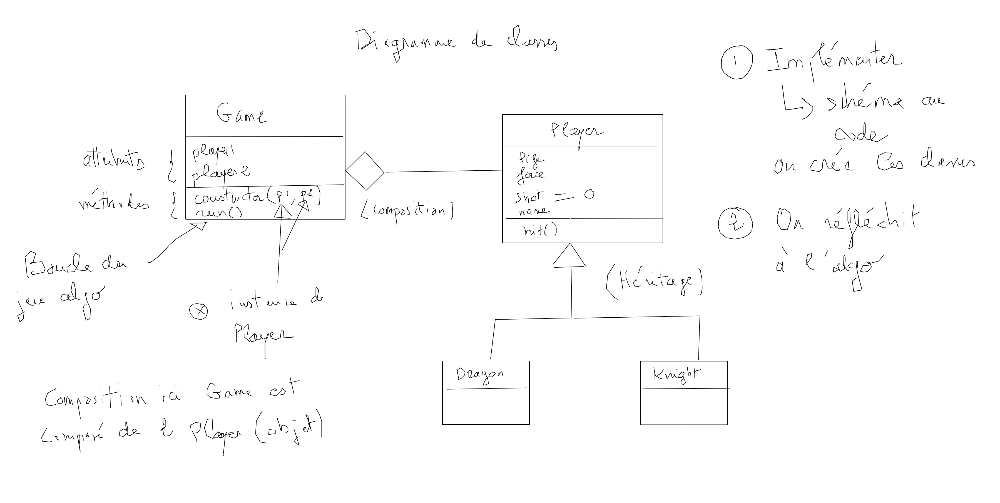

# Introduction

Les classes ont été introduites avec ECMAScript2015.

## Définition

Les classes sont des fonctions spéciales.

### Généralités sur la notion de classe

On utilise le mot clé **class** suivi du nom de la classe elle-même pour la définir. La classe est un modèle à partir duquel on peut créer autant d'objets qu'on le souhaite, appelés **instances**. Pour créer une nouvelle instance, on utilise le mot-clé new suivi du nom de classe.

Lors de l'instanciation avec le mot-clé new, une méthode spéciale de la classe est appelée, le **constructeur**. En JS, le constructeur porte le nom réservé constructor, et les **attributs (ou propriétés)** de la classe y sont définis. On attache les attributs à l'instance de classe à l'aide du mot clé this :

```js
class Rectangle{
   
    constructor(w, h){
        // attributs de classe
        this._w = w;
        this._h = h;
       
        this.name = "Rectangle";
    } 

    // ...
}

// création de deux instances
const unRectangle = new Rectangle(30, 50);
const unAutreRectangle = new Rectangle(20, 35);
```

Contrairement à d'autres langages comme PHP, JS n'implémente pas de visibilité private (...pas avant ES2019 en tout cas !), tous les attributs et toutes les méthodes sont publics. On peut toutefois faire "comme si" une propriété était privée, ne la manipuler directement que depuis l'intérieur de la classe, et définir des accesseurs **setter** et **getter** pour y accéder en écriture et en lecture. Il faudra cependant faire attention au nom de ces attributs dans la classe, une technique classique consiste à préfixer leurs noms par un underscore.

Par exemple dans le code qui suit, la propriété se nomme _table, mais le code principal est écrit comme si on accédait à une propriété table (sans underscore). Ce sont en fait nos accesseurs qui sont appelés :

```js
class Model{
    // constructeur
    constructor(tableName){
        this._table = tableName;
    }

    get table (){
        return this._table;
    }

    set table(tableName){
        this._table = tableName;
    }
}

const m = new Model("posts");

m.table ; // accéder à la valeur de l'attribut, l'accesseur get table est invoqué

m.table = "POSTS";  // modifier l'attribut, l'accesseur set table est invoqué

```

Les **méthodes** de classe sont des simples méthodes nommées, voyez l'exemple de la méthode **dim** ci-dessous dans la classe Rectangle :

```js
class Rectangle{
    // constructeur
    constructor(w, h){
        this._w = w;
        this._h = h;
    }

    // getter
    get area(){
        return this._w * this._h;
    }

    // setter 
    set w(w){
        this._w = w;
    }

     set h(h){
        this._h = h;
    }

    // méthode de classe
    dim(){
        return `Width : ${this._w} Height : ${this._h}`;
    }
}

let r1 = new Rectangle(10, 2);
// 20
console.log(r1.area);

r1.w = 100;
r1.h = 30;

// 3000
console.log(r1.area);

console.log(r1.dim())
```

## Exercice Parser

Créez une classe Parser, elle permettra de parser une chaîne de caractères en fonction d’un motif. Voyez l’exemple de l’utilisation de cette classe ci-dessous avant d’implémenter le code :

```js
const phrase = '8790: bonjour le monde:8987:7777:Hello World:    9007';

const p = new Parser(':');
p.parse(phrase);
console.log(p.str);
//8790 8987 7777 9007
```

### Héritage

Vous pouvez spécialiser une classe en héritant d'une classe parente plus générale. Rappelez-vous du principe de l'héritage en objet : une classe fille **est une sorte de** par rapport à la classe mère. Par exemple, un Lion est une sorte d'Animal. Dans ce cas la classe Lion est la classe fille de la classe Animal. C'est une spécialisation.

Pour définir une classe étendue vous devez utiliser le mot clé extends. 

Le mot clé **super** permet de faire passer des valeurs au constructeur de la classe mère. Attention, si vous êtes dans une classe dérivée (fille) et que vous définissez un constructeur de classe, vous êtes obligés d'utiliser super pour accéder au constructeur de la classe mère.
Si toutefois vous ne définissez pas de constructeur dans votre classe dérivée, le constructeur de la classe mère est automatiquement appelé.
Notez enfin que si vous définissez des attributs de classe dans le constructeur de votre classe dérivée, vous devez le faire après la méthode super, JS bloquera la compilation si ce principe de syntaxe n'est pas respecté.

```js
class Animal { 
    constructor(name) {
        this._name = name;
    }

    set name (name){
        this._name = name;
    }
  
    speak(){
        return `Name : ${this._name}`;
    }
}

class Lion extends Animal {
  constructor(name) {
    super(name); 
    // les this s'écriront après le mot clé super. JS vous
    // empêchera syntaxiquement de l'écrire avant super 
    this.force = 100;
  } 
}

let lion = new Lion("Shere")
lion.name = "Shere Khan";

console.log(lion.speak())
```

## Exercice Square Rectangle

Créez une classe Square et Rectangle. Laquelle des deux classes hérite de l'autre ? Répondez à la question avant de les implémenter ?

En utilisant l'héritage créez la classe Square avec un constructeur, cette class n'aura pas d'autre méthode. Implémentez dans la classe Rectangle les méthodes suivantes : area, dim. Créez les setter et getter permettant de mettre à jour les attributs de la classe.

## Attribut statique

Vous pouvez définir des attributs statiques dans une classe JS. Dans ce cas cet attribut dépendra de la classe et non de l'instance de classe.

```js
class Lion extends Animal { 

    static AGE_MIN = 1;

    constructor(name) {
        super(name);
    }

    get age() {
        return AGE_MIN;
    }

}

```

## Exercice Dragon & Knight

Créez les classes suivantes : Dragon et Knight qui héritent de la classe **Player** et une classe Game. 

Dans un seul et même fichier un dragon et un chevalier s'affrontent en se portant des coups de manière aléatoire. La classe Game est composée de deux objets Dragon et Knight de type Player.

Lorsqu'un des deux adversaire n'a plus de vie la partie est terminée et le vainqueur est celui qui possède encore de la vie. 

Les classe Dragon et Knight auront :

**Attributs**

- force <- number

- life  <- number

- shot  <- statistique sur le nombre de coups portés 

- name  <- string

**Méthodes**

- hit()  <- retirer de la vie de manière aléatoire dans le combat

La classe **Game** aura les attributs et méthode suivantes :

- players : les deux joueurs Dragon & Knigth 

- run() <- méthode qui lancera le jeu (boucle de jeu)

Indications : voici un schéma pour vous aidez à implémenter le code (écrire le code dans le fichier) :

